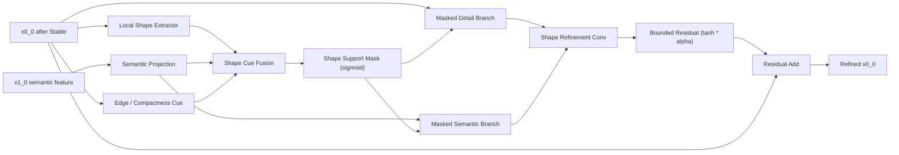

# DNANet-LDEM-Gate-Stable-Shape 设计稿

## 1. 设计目标

当前 `DNANet-LDEM-Gate-Stable` 已经具备三层能力：

- `LDEM`：增强浅层弱小目标细节
- `Gate`：筛掉一部分伪高亮响应
- `Stable`：抑制后期训练波动，减少复杂场景下的晚期崩塌

下一步最值得补的是 **shape prior**。原因很直接：

- `IRSTD-1K` 复杂背景里，很多误检并不是“没有亮度”，而是“亮度像目标，但形状不像目标”
- 当前 V3 已经能做“细节增强 + 选择性保留 + 稳定约束”，但还没有显式回答：
  - 哪些响应具有 **小目标的局部形状一致性**
  - 哪些响应只是背景边缘、建筑高光、噪声团块

因此第四版建议引入：

- **`ShapePriorRefinementUnit`**
- 新模型名：
  - **`DNANet_LDEM_Gate_Stable_Shape`**


## 2. 核心思想

### 2.1 想解决什么问题

在红外小目标检测里，目标通常具有以下局部结构属性：

- 尺度小
- 响应紧凑
- 局部中心-边缘过渡比较稳定
- 与大面积背景纹理、长边缘、杂波条带在形状统计上不同

所以 `ShapePriorRefinementUnit` 不做大而重的分支，而是只在浅层特征上做一件事：

- **学习一个“形状支持掩码（shape support mask）”**
- 让符合目标局部结构的响应被保留
- 让不符合目标局部结构的响应被抑制


### 2.2 和 ISNet 的关系

这条思路与文献中 `ISNet: Shape Matters for Infrared Small Target Detection` 的方向是一致的：

- `ISNet` 的代表性价值，不在于“必须照搬原网络”
- 而在于它明确指出：
  - **红外小目标检测不能只看亮度和语义，还要看目标形状**

对你当前这条 DNANet 改进主线来说，最合理的做法不是整套替换成 `ISNet`，而是：

- 保留你已经验证有效的 `LDEM + Gate + Stable`
- 再把 **shape-aware refinement** 作为一个轻量插件接进浅层主干

这样科研叙事会非常顺：

1. `V1` 先增强浅层细节
2. `V2` 再做选择性保留
3. `V3` 解决后期不稳定
4. `V4` 再用形状先验进一步压制复杂背景伪目标


## 3. 建议结构

### 3.1 插入位置

形状模块建议接在 `StableRefinementUnit` 之后，`x0_1` 之前。

也就是当前 V3 流程：

```text
input
  -> conv0_0
  -> LDEM
  -> conv1_0
  -> DetailSelectiveGate
  -> StabilityRefinementUnit
  -> conv0_1
```

改成：

```text
input
  -> conv0_0
  -> LDEM
  -> conv1_0
  -> DetailSelectiveGate
  -> StabilityRefinementUnit
  -> ShapePriorRefinementUnit
  -> conv0_1
```

原因：

- `LDEM` 后的特征保留了足够多的低层细节
- `Gate` 后已经初步筛掉一批无效响应
- `Stable` 后特征波动更小，更适合继续做 shape-aware 精修
- 如果 shape 模块接得太早，容易把噪声也当成结构
- 如果接得太晚，浅层几何信息已经被后续融合冲淡


### 3.2 结构图




## 4. 模块拆解

### 4.1 输入

输入仍然只需要两路：

- `detail_feat`：经过 `StableRefinementUnit` 后的浅层特征
- `semantic_feat`：来自 `x1_0` 的下一层语义特征


### 4.2 Local Shape Extractor

目标是从浅层特征中提取局部几何模式，而不是仅仅提亮响应。

建议使用轻量多分支结构：

- `3x3 depthwise conv`：局部紧凑结构
- `5x5 depthwise conv`：稍大一点的目标形态
- `1x3 + 3x1`：细长边缘与方向性结构

然后将这些分支拼接后压回原通道数。

这样比单一卷积更容易区分：

- 点状/团状目标
- 长边缘杂波
- 局部高亮噪声


### 4.3 Edge / Compactness Cue

建议再额外引入一个非常轻量的边界紧凑提示：

- `local_mean = avg_pool(detail_feat)`
- `edge_like = abs(detail_feat - local_mean)`

它不是传统显式边缘算子，而是一个低成本的局部差异提示。

作用：

- 目标通常是局部集中的小响应
- 大片背景高亮、条带、屋顶边缘等响应更容易在该分支中表现出不同统计


### 4.4 Semantic Projection

和 `Gate` / `Stable` 一样，把 `x1_0` 上采样到浅层尺度后用 `1x1 conv` 投影。

它的作用不是主导形状，而是提供：

- 哪些浅层结构和高层语义一致
- 哪些浅层结构虽然亮，但不符合目标语义


### 4.5 Shape Support Mask

把三类信息融合：

- `shape_feat`
- `semantic_shape_feat`
- `edge_like`

得到一个 `shape_mask`：

```text
shape_mask = sigmoid(F([shape_feat, semantic_proj, edge_like]))
```

这个 mask 的含义是：

- 结构上像目标
- 语义上也更可能是目标
- 而不是随机亮点或复杂背景边缘


### 4.6 Residual Refinement

不要直接用 `shape_mask` 硬乘完就输出，而是走一个小残差修正：

```text
refined = Conv([detail_feat * shape_mask, semantic_proj * shape_mask])
refined = tanh(refined) * alpha
output = ReLU(detail_feat + refined)
```

这样更稳：

- 不会把原特征完全覆盖掉
- 也能延续 V3 的“限幅稳定”思想


## 5. 推荐代码结构

### 5.1 新增类名

建议新增：

- `ShapePriorRefinementUnit`
- `DNANet_LDEM_Gate_Stable_Shape`


### 5.2 推荐伪代码

```python
class ShapePriorRefinementUnit(nn.Module):
    def __init__(self, channels, semantic_channels):
        super().__init__()
        self.semantic_proj = ...
        self.shape_branch_3x3 = ...
        self.shape_branch_5x5 = ...
        self.shape_branch_h = ...
        self.shape_branch_v = ...
        self.shape_fuse = ...
        self.edge_proj = ...
        self.shape_gate = ...
        self.refine = ...
        self.residual_scale = nn.Parameter(torch.tensor(0.05))
        self.activate = nn.ReLU(inplace=True)

    def forward(self, detail_feat, semantic_feat):
        semantic_feat = upsample_and_project(semantic_feat)
        local_mean = avg_pool(detail_feat)
        edge_like = torch.abs(detail_feat - local_mean)

        shape_feat = fuse(
            branch_3x3(detail_feat),
            branch_5x5(detail_feat),
            branch_h(detail_feat),
            branch_v(detail_feat),
        )

        shape_mask = sigmoid(
            gate(cat(shape_feat, semantic_feat, edge_proj(edge_like)))
        )

        refined = self.refine(
            cat(detail_feat * shape_mask, semantic_feat * shape_mask)
        )
        refined = torch.tanh(refined) * self.residual_scale
        return self.activate(detail_feat + refined)
```


## 6. 代码插入位置

以下位置基于当前文件：

- [model_DNANet.py](D:\Program Files (x86)\IRSTD\BasicIRSTD\model\DNANet\model_DNANet.py)

### 6.1 插入新模块类

建议插入在：

- `StabilityRefinementUnit` 之后
- `VGG_CBAM_Block` 之前

当前大致位置：

- `StabilityRefinementUnit` 结束于第 `156` 行
- `VGG_CBAM_Block` 开始于第 `159` 行

因此新类最合适插在：

- **约第 `158` 行附近**


### 6.2 新增第四版模型类

建议在 `DNANet_LDEM_Gate_Stable` 后面新增：

- `class DNANet_LDEM_Gate_Stable_Shape(DNANet):`

当前 `DNANet_LDEM_Gate_Stable` 从第 `468` 行开始。

最稳妥的做法：

- 保留 V3 类不动
- 在其后新增 V4 类


### 6.3 在 `__init__` 中新增 shape 模块

当前 V3 的初始化位置：

- 第 `482` 行：`self.ldem0 = LDEM(nb_filter[0])`
- 第 `483` 行：`self.detail_gate0 = DetailSelectiveGate(...)`
- 第 `484` 行：`self.stable_refine0 = StabilityRefinementUnit(...)`

V4 建议新增：

```python
self.shape_refine0 = ShapePriorRefinementUnit(nb_filter[0], nb_filter[1])
```

放在：

- `self.stable_refine0` 之后


### 6.4 在 `forward` 中新增调用

当前 V3 关键前向位置：

- 第 `491` 行：`x0_0 = self.detail_gate0(x0_0, x1_0)`
- 第 `492` 行：`x0_0 = self.stable_refine0(x0_0, x1_0)`
- 第 `493` 行：`x0_1 = self.conv0_1(...)`

V4 应改成：

```python
x0_0 = self.detail_gate0(x0_0, x1_0)
x0_0 = self.stable_refine0(x0_0, x1_0)
x0_0 = self.shape_refine0(x0_0, x1_0)
x0_1 = self.conv0_1(torch.cat([x0_0, self.up(x1_0)], 1))
```

也就是：

- **新增一行插在当前第 `492` 行和第 `493` 行之间**


### 6.5 注册模型

如果后面正式实现，还需要同步修改：

- [model/__init__.py](D:\Program Files (x86)\IRSTD\BasicIRSTD\model\__init__.py)
- [net.py](D:\Program Files (x86)\IRSTD\BasicIRSTD\net.py)

建议新增名称：

- `DNANet-LDEM-Gate-Stable-Shape`


## 7. 为什么这版比 V3 更合理

### 相对 baseline `DNANet`

新增的是一条完整且递进的浅层优化链：

- baseline：只做 nested dense interaction
- V1：补细节
- V2：补选择
- V3：补稳定
- V4：补形状先验

这比单纯“再堆一个注意力模块”更有论文逻辑。


### 相对 V3

V3 的核心短板是：

- 已经能稳定，但对“伪目标长边缘/不规则高亮”仍缺少显式形状判别

V4 的价值就在于：

- 不是继续追求更强响应
- 而是追求 **更像目标的响应**

尤其对 `IRSTD-1K` 这类复杂背景数据，更有希望减少：

- 晚期误检抬头
- 个别 epoch 波动
- peak 高但 final 不稳


## 8. 训练与验证建议

实现后建议按下面顺序验证：

1. 先做 `forward sanity check`
   - 确认输出尺寸不变
   - 确认无通道不匹配

2. 再做 `1 epoch smoke test`
   - 确认 loss 正常下降
   - 确认显存没有异常增长

3. 再做 `IRSTD-1K 10 epoch`
   - 优先看是否比 V3 更稳

4. 最后补 `40 epoch`
   - 记录 `loss / mIoU / PD / FA`


## 9. 当前最推荐的落地版本

如果你希望下一步直接实现，我建议代码上采用：

- 轻量多分支 shape extractor
- `shape mask` 只做残差修正，不做硬替换
- 延续 V3 的 `tanh * residual_scale` 稳定策略

一句话概括：

- **V4 不是再“增强细节”，而是对已经稳定下来的细节做“形状一致性筛选”。**
